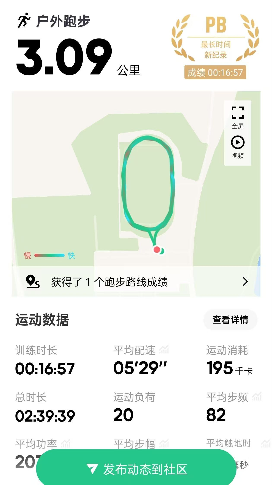
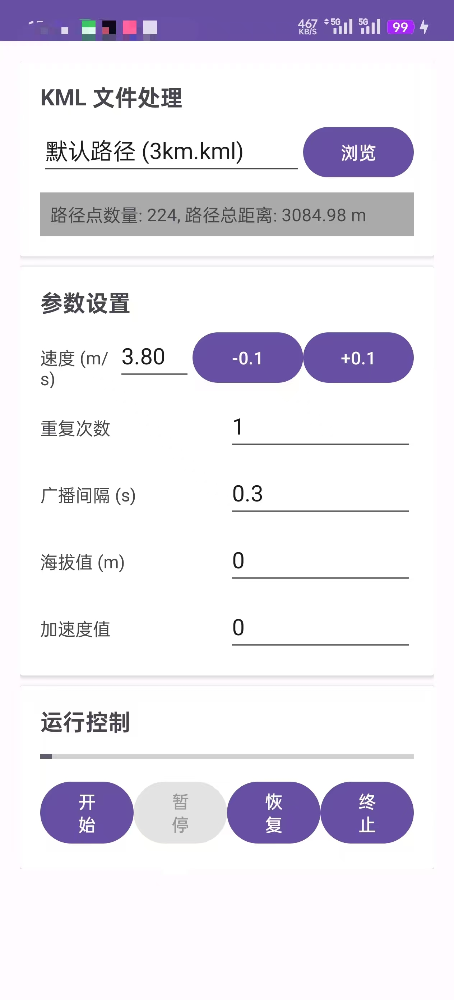

# dlut-FakeRun

内置了 dlut 的操场路径 可以模拟校园跑 随时更改速度

> [!CAUTION]
> 本项目仅供娱乐，请合理使用。

## 使用方式

- **真机环境：**

  - 推荐 Android 11 及以上，无需 root
  - 1. 启用 `开发者选项`
  - 2. 在 `选择位置模拟信息应用` 中选择该应用
  - 3. 点击开始直接运行模拟
  - 推荐使用 `悬浮窗`方式前台运行，后台运行可能会不稳定。
  - 支持 `小米运动健康`、`华为运动健康`等，但不支持 `Keep`。

- **模拟器环境：**

  - 推荐使用 `BlueStacks 5 China`，选择 Android 11 系统。
  - 主流模拟器无需配置点击开始直接运行模拟
  - 支持 `Keep`、`小米运动健康`等运动健康 App。

## 自定义路径

[https://github.com/LangQi99/dlut-FakeRun/blob/main/app/src/main/res/raw/three_km.kml](https://github.com/LangQi99/dlut-FakeRun/blob/main/app/src/main/res/raw/three_km.kml) 可以参考此文件 在 `google earth` 中自行绘制你自己需要的路径

后续可能会考虑更方便的方式

